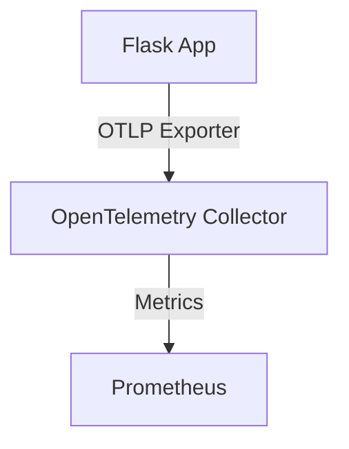

# 🔍 Flask Observability with OpenTelemetry & Prometheus

<div align="center">


**A lightweight Flask application with observability features including metrics and traces, using OpenTelemetry and Prometheus.**

</div>

---

## 📖 Overview

This project demonstrates a simple Flask backend instrumented with **OpenTelemetry** for collecting:

- ✅ Metrics (via Prometheus)

It uses the **OTLP HTTP exporter** to send telemetry to the OpenTelemetry Collector, which forwards the data to Prometheus for visualization and analysis.

---

## 🧱 Architecture



📂 Project Structure
```bash
flask-otel/
│
├── Dockerfile                       # Build the Flask app
├── app.py                           # Flask application with OTEL instrumentation
├── docker-compose.yml              # Multi-service orchestration
├── otel-collector-config.yaml      # OpenTelemetry Collector config
├── prometheus.yml                  # Prometheus config
└── requirements.txt                # Python dependencies
```

⚙️ Prerequisites
🐳 Docker & Docker Compose

🐍 Python 3.9+ (for local running)

🌐 Git

🚀 Getting Started
🔧 Clone the Repository
```bash
git clone https://github.com/your-username/flask-otel.git
cd flask-otel
```

🐍 Install Python Requirements (if running manually)
```bash
python -m venv venv
source venv/bin/activate  # On Windows: venv\Scripts\activate
pip install -r requirements.txt
```

🐳 Start the App with Docker Compose
```bash
docker-compose up --build
```

Wait for a few seconds until all services are running.

🌐 URLs for Services
| Tool           | URL                      | Description         |
|----------------|---------------------------|---------------------|
| 🧪 Flask App    | http://localhost:5000     | Base endpoint       |
| 📈 Prometheus   | http://localhost:9090     | Metrics dashboard   |

📡 Observability Features
📊 Metrics (via Prometheus)
Total requests counter by endpoint

Scraped using the OTEL collector at /metrics

🔗 API Endpoints
| Method | Endpoint   | Description             | Observability     |
|--------|------------|-------------------------|-------------------|
| GET    | `/`        | Returns Hello Message   | ✅ Metrics         |
| GET    | `/create`  | Simulates work + Metrics| ✅ Metrics         |
| GET    | `/health`  | Health check            | ✅ Status Only     |

📜 OpenTelemetry Collector Config
The collector listens on:

4318 for OTLP/HTTP (from Flask)

Exports:

Metrics → Prometheus (:9464)

📌 Prometheus Scrape Config
Prometheus is configured to scrape metrics from the OTEL Collector's Prometheus exporter on :9464.

🛠️ Tech Stack
🖥️ Flask – Web framework

📦 OpenTelemetry – Metrics + Tracing instrumentation

📊 Prometheus – Metrics collection

🐳 Docker Compose – Service orchestration

📥 Sample Curl Test
```bash
curl http://localhost:5000/
curl http://localhost:5000/create
```

---

📄 Feel free to fork, modify, and use for your own learning or observability setups.

---

<div align="center">
💡 Star this repo if it helped you understand observability in microservices!

Made by Sushindh A

</div>

---
